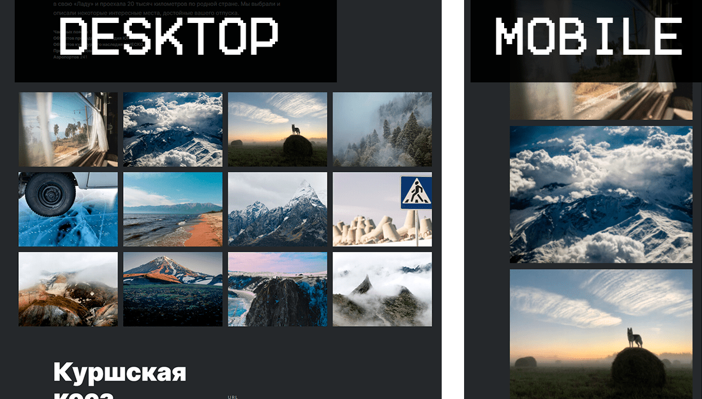
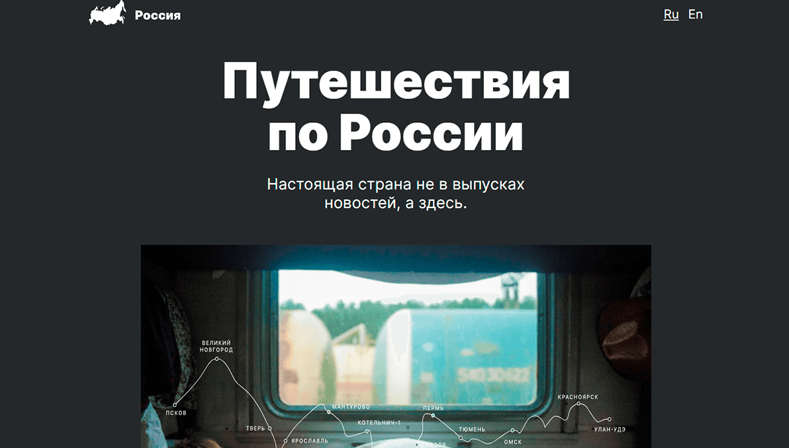

# Путешествие по России. Домашняя работа на Яндекс.Практикум

Данный проект является результатом обучения на курсе от Яндекс.Практикум.
Цель данного сайта научиться создавать адаптивные сайты. Сайт основан на макете Figma. [Ссылка на макет в Figma](https://www.figma.com/file/5S2WSbEFL6awjVWJ0NWL8Q/Sprint-3_-Russia-_-desktop-mobile?node-id=28503%3A0)

На странице релизованны:
1. Flexbox вёрстка
2. Grid
3. Адаптивная верстка.
4. CSS-анимация
5. Файловая структура проекта по правилам Nested БЭМ

## Демонстрация

В зависимости от разрешения экрана сраница изменяет размер элементов и верстку в некоторых местах.

  > 

## Ссылка на проект

   [Страница Путешествие по России](https://kiars1.github.io/russian-travel)
   
   

## Развитие проекта